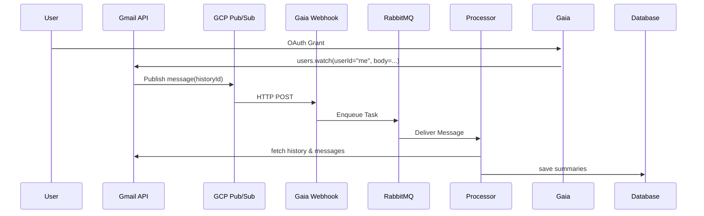

# Detailed Guide: Google Cloud Pub/Sub in Gaia Mail Sync

This guide provides an in-depth overview of Google Cloud Pub/Sub, explains how it works, and describes exactly how our Gaia backend application uses it for Gmail push notifications. It also includes setup instructions for development and production.

---

## 1. What is Google Cloud Pub/Sub?

Google Cloud Pub/Sub is a fully-managed messaging service that decouples services that produce events (publishers) from services that process events (subscribers). Key concepts:

- **Topic**: A named resource to which messages are sent by publishers.
- **Publisher**: The entity (e.g., Gmail API) that sends messages to a topic.
- **Subscription**: A named resource representing the stream of messages from a single topic, to be delivered to subscribers.
- **Subscriber**: The entity (e.g., Gaia webhook) that receives or pulls messages from a subscription.
- **Message**: The data payload (and optional attributes) sent by a publisher on a topic.

Pub/Sub supports two delivery modes:

1. **Pull**: Subscriber explicitly pulls new messages.
2. **Push**: Pub/Sub pushes messages via HTTP to a configured endpoint.

---

## 2. High-Level Flow in Gaia

1. **Watch Setup**: When a user connects their Gmail account, our backend calls Gmail’s Watch API:
   - Passes the user’s OAuth tokens and a Pub/Sub topic name.
   - Gmail registers the subscription and begins sending history notifications.
2. **Gmail Publishes Messages**: Gmail sends `historyId` updates to our Pub/Sub **Topic**.
3. **Push Delivery**: Pub/Sub **Subscription** (push type) forwards each message to our webhook endpoint: `/api/v1/notifications/gmail`.
4. **Webhook Processing**:
   - The endpoint validates and parses the incoming JSON.
   - Extracts `historyId` and user email metadata.
   - Enqueues a processing job in RabbitMQ.
5. **Email Processing**:
   - Worker consumes the queue, calls Gmail History API to retrieve changed message IDs.
   - Fetches each email’s full content.
   - Applies AI-based summarization, tagging, and internal commands.
   - Persists results in MongoDB and updates user status.




---

## 3. Quickstart Setup

Follow these steps:

1. In the GCP Console, create a Pub/Sub topic and a Push subscription (subscriber).
2. Run your local server and expose it via ngrok:
   ```bash
   uvicorn app.main:app --reload --port 8000
   ngrok http 8000
   ```
3. In the GCP Console, edit the Push subscription to use endpoint: `https://<YOUR_NGROK_URL>/mail-webhook/receive`.
4. Update the `GCP_TOPIC_NAME` secret in Infisical to your topic resource name (e.g., `projects/your-project/topics/gmail-notifications`).

---

### Detailed Setup Instructions

### A. Prerequisites

- Google Cloud project with billing enabled
- Gmail API enabled
- OAuth 2.0 credentials for your application
- Domain verified if using a custom domain for push endpoints

### B. Create Pub/Sub Topic

1. **Console**: GCP Console → Pub/Sub → Topics → Create Topic
2. **Permissions**: Ensure the Gmail service account (or default GCP service account) has the `pubsub.publisher` role on the topic.

### C. Create Push Subscription

1. **Console**: Topic → Create Subscription →
   - Name: `gmail-notifications-sub`
   - Delivery Type: **Push**
   - Endpoint URL: `https://<YOUR_DOMAIN>/api/v1/notifications/gmail`
   - Acknowledgement Deadline: 60s
   - Retry Policy: Exponential backoff, initial 10s
3. **Permissions**: Grant `pubsub.subscriber` role to your app’s service account.

### D. Local Development with ngrok

To test push subscriptions locally:
1. Install ngrok: `brew install ngrok` or [download](https://ngrok.com/download).
2. Run your local server on port 8000:
   ```bash
   uvicorn app.main:app --reload --port 8000
   ```
3. Start ngrok:
   ```bash
   ngrok http 8000
   ```
- Go to the Google Cloud Console → Pub/Sub → **Subscriptions** → select `gmail-notifications-sub` → click **Edit Subscription** → update the **Push endpoint URL** to `https://<your-ngrok-url>/api/v1/mail-webhook/receive` and save.

---

## 4. Configuration in Gaia

Gaia uses [Infisical](https://infisical.io/) to manage secret environment variables. You need to set the following secrets:

- `GCP_TOPIC_NAME`: The full Pub/Sub topic resource name, e.g., `projects/your-gcp-project-id/topics/gmail-notifications`
- `GCP_SUBSCRIPTION_NAME`: The Pub/Sub subscription name, e.g., `gmail-notifications-sub`
- `ENABLE_PUBSUB_JWT_VERIFICATION`: Boolean flag to enable/disable JWT authentication for Pub/Sub webhooks (default: `true`)

All other application settings, such as OAuth credentials and webhook URLs, are managed securely in Infisical and do not require manual `.env` configuration.

### Authentication Security

Gaia now implements JWT token verification for Pub/Sub push subscriptions to ensure that webhook requests come from Google Cloud and not unauthorized entities. This follows Google's recommended security practices:

- **JWT Verification**: Each push request must include a valid JWT token in the Authorization header
- **Signature Validation**: Tokens are verified using Google's public keys
- **Claims Validation**: Audience, issuer, and expiration claims are validated
- **Configurable**: Can be disabled in development environments by setting `ENABLE_PUBSUB_JWT_VERIFICATION=false`

To enable JWT authentication for your Pub/Sub subscription:
1. In GCP Console → Pub/Sub → Subscriptions → select your subscription
2. Edit subscription settings and enable "Authentication" with proper service account
3. Ensure your subscription is configured to send JWT tokens

---

## 5. Code References

- **watch_mail.py**: Calls `service.users().watch(userId="me", body=...)`
- **router/mail_webhook.py**: Defines `/api/v1/mail-webhook/receive` endpoint to parse Pub/Sub push messages with JWT authentication
- **utils/pubsub_auth.py**: Implements JWT token verification for Pub/Sub push subscriptions
- **services/mail_webhook_service.py**: Enqueues jobs to RabbitMQ for further processing
- **worker.py**: Consumes RabbitMQ tasks and fetches email data from Gmail

---

## 6. Best Practices and Troubleshooting

- **Message Retry**: Use idempotent processing; Pub/Sub may redeliver on failure.
- **Authentication**: JWT token validation is now implemented by default to verify Pub/Sub push messages come from Google Cloud.
- **Security**: Never disable JWT verification in production environments unless absolutely necessary.
- **Development**: For local development, you may need to disable JWT verification temporarily with `ENABLE_PUBSUB_JWT_VERIFICATION=false`.
- **Scaling**: Adjust `max_concurrent` for `renew_gmail_watch_subscriptions` based on resource limits.
- **Monitoring**: Use Stackdriver (Cloud Monitoring) for Pub/Sub metrics and logs.
- **Error Handling**: Log and surface errors in `renew_gmail_watch_for_user` and webhook failures.
- **Token Issues**: If JWT verification fails, check subscription configuration and ensure tokens are being sent.

## 7. Additional Resources

- [GCP Pub/Sub Documentation](https://cloud.google.com/pubsub/docs)
- [Gmail API Push Notifications](https://developers.google.com/gmail/api/guides/push)
- [Mermaid Sequence Diagrams](https://mermaid.js.org)

---

_This guide aims to make Google Cloud Pub/Sub setup and usage in Gaia clear and straightforward. For any questions or updates, please open an issue in the repo._
