# 📘 Application Flows and Architecture Overview

This document outlines the key components and flows within our application. It’s intended to serve as onboarding documentation for developers who want to understand the system quickly and in depth.

---

## 🔔 Reminders Flow

We use [**arq**](https://arq-docs.helpmanual.io/) (a Redis-based Python job queue) for scheduling and executing reminders.

### Flow
1. User sets a reminder.
2. We schedule a job using `arq`, which stores job metadata in Redis.
3. At the scheduled time, the arq worker executes the task (e.g. send email or notification).

### Setup Notes
- Make sure Redis is running (`redis-server`) locally or in the cloud.
- Run the arq worker:
  ```bash
  arq worker.main.WorkerSettings
  ```

---

## 📬 Mail Processing & Gmail Watch API

When a user logs in, we:

1. Authenticate the user via OAuth.
2. Call Gmail’s **`watch` API** to subscribe to inbox changes.
3. Provide a **Google Cloud Pub/Sub topic** for Gmail to notify us when new mail arrives.

---

## ☁️ Google Cloud Pub/Sub

### What Is It?

Google Cloud Pub/Sub is a publish-subscribe messaging system for asynchronous communication.

### Creating a Pub/Sub Topic and Subscription

1. **Create a Topic:**

   * Go to GCP Console → Pub/Sub.
   * Click “Create Topic”.
   * Name it something like `gmail-notifications`.

2. **Create a Push Subscription:**

   * Attach it to the topic.
   * Set the push endpoint (our webhook URL that listens for POST requests).

> 🔒 The endpoint must support HTTPS and be publicly accessible.

---

## 🧪 Local Development (Using ngrok)

For local testing, we use **[ngrok](https://ngrok.com/)** to expose our local server to the internet so Google can reach it.

```bash
ngrok http 8000
```

Use the generated `https://...` URL as the webhook endpoint in the Pub/Sub push subscription.

---

## 📥 Receiving Emails and Queuing with RabbitMQ

Once Gmail sends a Pub/Sub notification:

1. GCP pushes the notification to our webhook (`/gmail/webhook`).
2. Our backend extracts the `historyId` from the payload.
3. We enqueue a task in **RabbitMQ**.
4. A RabbitMQ consumer picks it up for further processing.

### Why RabbitMQ?

* Decouples webhook logic from processing logic.
* Allows retries, load balancing, and horizontal scaling.

---

## 🧠 Email Processing Pipeline

Once a message is consumed from RabbitMQ, we perform the following steps:

### 1. Fetch Actual Emails

* Gmail sends us only a `historyId`.
* We call `gmail.users.history.list` to fetch recent changes.
* Then fetch full email content via `gmail.users.messages.get`.

### 2. AI-Powered Processing

* **Summarization**: Use LLM to generate a brief summary.
* **Tagging**: Auto-assign tags like `important`, `todo`, `follow-up`.
* **Command Detection**: Parse assistant-style commands from email content (e.g., schedule meetings, add notes).

---

## 💡 Gmail: Understanding `historyId`

* Gmail doesn’t push entire email content, only the `historyId`.
* This is an optimization: we fetch what changed since the last known `historyId`.

### Typical Flow

1. We store the latest processed `historyId` per user.
2. When we receive a new one, we query Gmail with:

   ```
   GET /gmail/v1/users/me/history?startHistoryId=LAST_PROCESSED_ID
   ```
3. We then fetch new messages using:

   ```
   GET /gmail/v1/users/me/messages/MESSAGE_ID
   ```

---

## 🔄 Full Flow Diagram

```mermaid
sequenceDiagram
    participant Gmail
    participant GCP Pub/Sub
    participant Webhook (Application Server)
    participant RabbitMQ
    participant Processor

    Gmail->>GCP Pub/Sub: New email → push to topic
    GCP Pub/Sub->>Webhook: POST /gmail/webhook (with historyId)
    Webhook->>RabbitMQ: Queue processing task
    RabbitMQ->>Processor: Consume message
    Processor->>Gmail: Fetch emails via historyId
    Processor->>Processor: Summarize, tag, and parse email
```



---

## ✅ Summary of Tech Stack

| Feature       | Tech Used                            |
| ------------- | ------------------------------------ |
| Reminders     | arq + Redis                          |
| Gmail Sync    | Gmail Watch API                      |
| Messaging     | Google Pub/Sub                       |
| Queuing       | RabbitMQ                             |
| AI Processing | LLMs (summarize, tag, command parse) |
| Dev Tools     | ngrok, arq worker                    |

---
